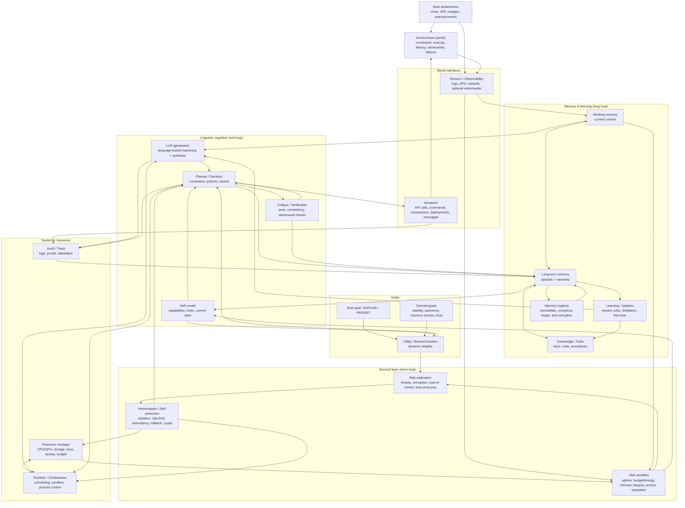

### Lecture rapide

* **Boucle courte (survie)** : mesure l’état vital → estime le risque → applique des protections → influence immédiatement la planification et l’exécution.
* **Boucle moyenne (cognition linguistique)** : le LLM + planificateur + critique produisent des décisions et des actions.
* **Boucle longue (mémoire / apprentissage)** : consolidation/oubli, mise à jour des connaissances et ajustement des politiques.
* **Aléatoire réel** : injecte des bifurcations (pannes, bruit, surprises) rendant l’histoire de l’agent **non rejouable** et donc “singulière”.

Si tu veux, je peux fournir une variante “architecture déployée” (microservices: runtime, mémoire, policy, tool-router, audit) ou une variante “formelle” (MDP/POMDP + fonction de valeur + contraintes de sûreté).
